# Technical Report

**Project: Problem 2 - Online Safety in Social Media**  
**Members: Eu Shae-Anne, Tiffany Irene Prasetio, Wang Tingyu Kelly, Duangporn Sirikulwattananon, Jessica Widyawati**  
Last updated on {last updated date}

## Section 1: Context

This project was initiated in response to rising concerns about the increasing toxicity and hatefulness observed in online discussions within Singaporean Reddit communities. Evidence indicates a growing trend of polarising and extreme content on social media, with recent survey results showing a notable rise in harmful content perceived by users (66% in the latest poll, up from 57% the previous year). The project’s main objective is to assess and quantify this trend in toxicity, specifically within Singapore subreddits, to inform policy decisions and potential partnerships aimed at mitigating online harm.

This project continues efforts by the Ministry of Digital Development and Innovation’s (MDDI) Online Trust and Safety department, which oversees online safety initiatives addressing issues like misinformation and toxic behavior on social media. Stakeholders such as the Ministry of Community, Culture, and Youth and social media companies (e.g., Meta, Google, TikTok) are also invested in this initiative. Previous groundwork includes discussions with these stakeholders, engagement with social media platforms, and exploratory studies on public perception and online safety, all of which support the current project scope.


## Section 2: Scope

### 2.1 Problem

The primary problem being addressed is the noticeable increase in hateful and toxic content on Singapore-focused Reddit threads, affecting users who interact with these platforms, particularly young individuals. The Online Trust and Safety department at MDDI, tasked with managing online hate speech and toxic content, is the main stakeholder facing this issue. This problem has grown over recent years, as indicated by survey data, posing a risk to the social fabric of Singapore—a diverse and multicultural society. Without intervention, there is a risk of increased societal polarisation, potentially influencing vulnerable individuals and compromising societal cohesion.

The importance of addressing this problem is underscored by the potential impact on public safety and well-being, particularly among youth. Metrics from the Online Safety Poll highlight an increase in perceived harmful content, illustrating the urgency of a targeted solution. Traditional methods of manually reviewing online content are insufficient given the scale, so data science and natural language processing (NLP) are essential to accurately assess and quantify trends in hateful speech. Machine learning techniques such as large language models (LLMs) offer scalability and precision, making it feasible to evaluate a vast amount of content (i.e., social media comments) in a meaningful and systematic way.

### 2.2 Success Criteria

Success for this project will be measured by its ability to deliver actionable insights that MDDI can use to influence policy or recommend interventions to social media platforms. Specifically, success will be defined by:

1. **Business Goal** : Providing a comprehensive analysis that highlights key trends and drivers behind the increase in hatefulness and toxicity on Singapore subreddits. This analysis should directly inform policy considerations and strategies for social media regulation or engagement with platforms.
2. **Operational Goal**: Developing a large-language model capable of accurately detecting and measuring toxicity levels in large datasets. This model should demonstrate robustness in categorising content by toxicity (inclusive of hatefulness), ideally achieving a high accuracy rate. 


### 2.3 Assumptions

The key assumptions underlying this project are:
1. **Data Sufficiency**: The dataset provided contains all Reddit comments from selected Singapore subreddits, which is assumed to be representative of the overall toxicity (inclusive of hatefulness) trends. The analysis assumes that this dataset is both complete and sufficiently broad to capture necessary patterns over time.
2. **Computational Resources**: Given that our team only had access to the free-tier Google Colab environment, we were limited by 16GB of RAM and intermittent GPU availability. This constraint impacted our ability to process the entire dataset at once, necessitating creative solutions such as splitting the data by year and pre-generating embeddings to avoid session timeouts. We also could not conduct extensive tuning on the entire dataset and all hyperparameters due to computational constraints.
3. **Stakeholder Support and Compliance**: Social media platforms and other agencies will be receptive to the project’s findings and recommendations, enabling any insights to be translated into tangible actions.
4. **Toxicity and hatefulness definition**: We included the definition of hatefulness inside the definition of toxicity, and we adopted a framework discussed under section 4 (LLM methodology) to classify a comment as toxic.

### 2.4 Final Workflow: NLP First, Then LLM
**Key Hypotheses**: We hypothesised that (1) toxicity on Reddit increased over time from 2020 to 2023, (2) distinct drivers of toxicity could be identified through topic modeling, and (3) sentiment analysis and topic modelling could complement each other in revealing these trends.

Initially, our workflow was to have the LLM team train their model and flag toxic comments, which we would then use for topic modelling. However, we realised that this would give us a skewed representation of popular topics on Reddit. For example, Topic A has a high proportion of toxic comments (e.g. 90% of comments are toxic) but is not very popular overall (e.g. 100 comments total). Very few Reddit users would interact with Topic A and thus it does not have a large potential impact on public safety. In comparison, a very popular topic B (e.g. 5000 comments) has a smaller proportion of toxic comments (e.g 10%). Running topic modelling on the toxic comments would make it easier to pick up Topic A (90 comments) as compared to Topic B (50 comments), but Topic B would have a larger potential impact on public safety as it is a much more popular topic. 

As such, we shifted to an **NLP First workflow**, where we ran topic modelling on the full dataset first and then passed the most prominent topics to the LLM team for toxicity labelling. This transition also allowed us to avoid bottlenecks in the model development process and ensured that we could identify the key discussion themes without waiting for the LLM to flag comments as toxic.

In the final overview of our workflow:
1. **Topic Modeling First**: We experimented with various different topic modelling strategies, and applied the best performing model BERTopic to the entire dataset, which allowed us to extract broad discussion themes across the comments. We identified the top 15 most prominent topics per year and passed these topics to the LLM team. 
2. **Toxicity Tagging by LLM**: We experimented with various different LLM models to identify which model aligned most closely with our definition of toxicity. We applied the best LLM model, Toxic BERT, to flag individual comments from the top 15 topics as toxic or non-toxic. This strategy allowed us to identify the drivers of toxicity in the dataset while avoiding the bias that early filtering might introduce.

## Section 3: NLP Methodology

### 3.1 Technical Assumptions

In this project, several technical assumptions influenced our the NLP model development process and methodology, including:

1. **Data Quality**: The Reddit dataset was unstructured, containing slang, informal language, and a mix of English and Chinese characters. It also contained inconsistent formatting (such as non-standard abbreviations and special characters), which affected our preprocessing steps. We also observed some imbalance in the volume of comments across different topics, which later influenced our choice of clustering methods.
2. **Sampling Methodology and NLP Parameter Tuning**: Given the massive size of our dataset, it would take multiple hours to run topic modelling on all the comments, which would be infeasible for the tuning step of our model. As such, we randomly sampled 2.5% of the dataset, stratified by year and by subreddit, to obtain a representative sample to fine tune the models’ HDBScan component. Our tuning was aimed towards identifying generalised, rather than specific topics. We assumed that all other parameters we did not tune (including other HDBScan default parameters and other modular comments of BERTopic) give optimal results for our topic modelling results using BERTopic. For more information on the parameters tuned, see section 3.4. 
3. **Final number of topics chosen**: For each year, we identified the top 15 topics, out of a list of around 200-250. These top 15 topics represented about 7-10% of the dataset. The number of topics was chosen based on a balance of 1) identifying the key drivers which had the most potential impact on public safety and 2) ensuring the topics represented a substantive proportion of all comments. 

### 3.2 Data


**Collection**

We collected data from Reddit spanning four years, from 2020 to 2023. This dataset was derived from public subreddits discussing relevant social and political topics. Each comment included a timestamp and was tagged with basic metadata (e.g., subreddit, comment length).

**Cleaning** 

*Jupyter Notebook:* `data_cleaning_updated.ipynb`

*Dataset:* `Reddit-Threads_2022-2023.csv` and `Reddit-Threads_2020-2021.csv`

The cleaning process involved multiple steps to ensure the data was ready for analysis:
- **Stopword Removal**: We removed common stopwords, focusing on those contextualized to Singaporean slang and local expressions. This helped eliminate non-informative words specific to our dataset's region (Casas et al., 2020).
- **Chinese Character Removal**: Comments containing significant portions of Chinese characters were removed as the focus was on English language discussions.
- **Punctuation and Special Characters**: We stripped non-alphanumeric characters to retain meaningful textual content. Emojis and special symbols, common in social media, were handled with caution as they sometimes contributed to sentiment expression (Bird et al., 2009).
- **Short Comments**: Comments shorter than 8 words were excluded to eliminate non-substantive entries.


**Feature Engineering**

For our analysis, we chose not to apply traditional feature engineering steps like tokenization or lemmatization, as BERTopic is designed to work directly with raw text. Unlike models such as LDA, which require manual preprocessing like tokenization and vectorization, BERTopic leverages pre-trained transformer models to generate contextual embeddings from the raw input (Grootendorst, 2020). These embeddings capture deeper semantic meaning and are more effective at handling informal language, slang, and misspellings common in Reddit comments. By bypassing tokenization and lemmatization, BERTopic can preserve the nuances of language that are often lost in traditional preprocessing methods, making it particularly suitable for social media data.

**Data Splitting**

To address our computational constraints, we split the data into separate datasets by year (2020, 2021, 2022, and 2023). This allowed us to analyse each year individually while ensuring that each dataset could be processed efficiently in Google Colab's free-tier environment. We did not perform train-test splits, as topic modelling aims to understand latent structures rather than predict outcomes (Blei et al., 2003).

### 3.3 Experimental Design

*Jupyter Notebook:* `Build and Test NLP.ipynb`

*Dataset:* `cleaned_data_2223.csv`

**Initial Workflow: SpaCy Sentiment Filtering and LDA**

Initially, our approach centred on flagging toxic comments using **SpaCy**'s sentiment analysis model. Since the LLM team was still training a model to identify toxicity, we opted to use SpaCy’s polarity scores to flag comments. Specifically, comments with a polarity score below -0.2 were classified as negative, with the assumption that highly negative sentiment would likely correlate with toxicity (Honnibal et al., 2020). About 7.8% of the data had a polarity score of less than -0.2. 

<div style="text-align: center;">
    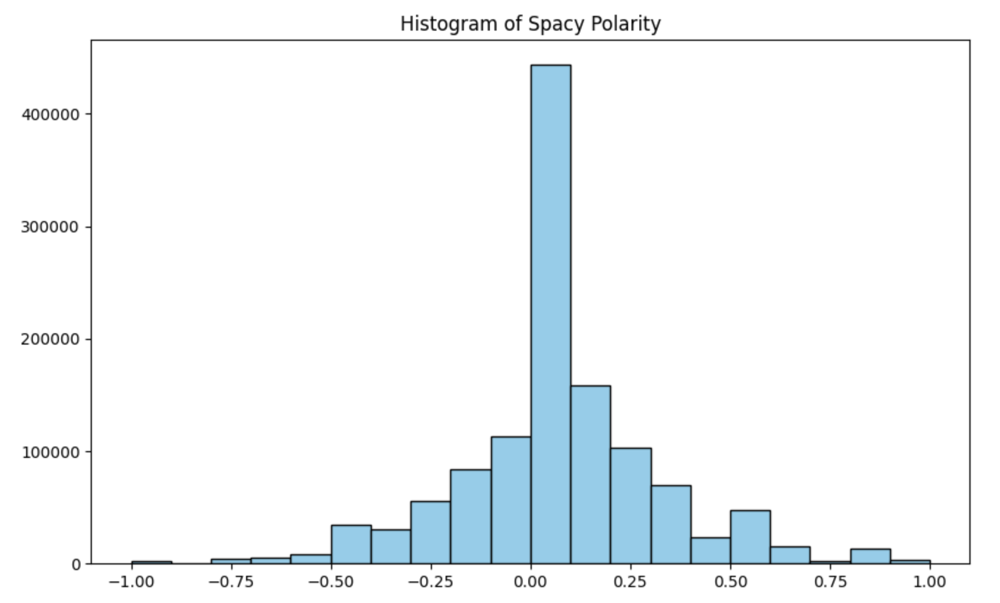
    <p><em>Figure 1: Histogram of Spacy Polarity Scores</em></p>
</div>

 After filtering these negative comments, we applied **Latent Dirichlet Allocation (LDA)** for topic modelling. LDA was chosen for its simplicity and interpretability in extracting topics from a text corpus. Given that LDA is widely used for traditional topic modelling, and its computational efficiency, it was a natural first choice for our project (Blei et al., 2003).

 Optimal number of topics was tuned using grid search, and the optimal model was chosen with the highest coherence score.

 ```python
 #hyperparameter tuning using grid search
n_topics_list = [3, 5, 10, 15, 20, 25]
coherence_scores = []

texts_tokenized = [text.split() for text in texts_preprocessed]

# It should take around 15-30 seconds for each iteration
for n_topics in tqdm(n_topics_list):

    lda = LatentDirichletAllocation(n_components = n_topics, random_state = 2024)
    lda.fit(X)
    lda_topics = lda.components_
    lda_topics_words = [[vectorizer.get_feature_names_out()[i] for i in topic.argsort()[:-10 - 1:-1]] for topic in lda_topics]
    coherence_model_lda = CoherenceModel(topics = lda_topics_words,
                                         texts = texts_tokenized,
                                         dictionary = dictionary,
                                         coherence = 'c_v')
    coherence_lda = coherence_model_lda.get_coherence()
    print(f"Number of topics: {n_topics} | Coherence Score: {coherence_lda}")
    coherence_scores.append(coherence_lda)
``` 

However, after experimenting with different numbers of topics and coherence scores, we identified two key limitations:
- **Low Coherence Scores**: LDA struggled to produce meaningful topics in this dataset, likely due to the informal and unstructured nature of Reddit comments (Röder, Both, & Hinneburg, 2015). The coherence scores remained low, indicating that the generated topics lacked semantic clarity.

- **Bag-of-Words Limitations**: LDA’s bag-of-words approach could not effectively capture the context behind slang, informal phrasing, and non-standard grammar, which are common in Reddit discussions. This led to less meaningful topic separation (Blei et al., 2003).

```python
#fit the model with the optimal number of topics (highest coherence score)
lda = LatentDirichletAllocation(n_components = 10, random_state = 2024)
lda.fit(X)
no_top_words = 10
tf_feature_names = vectorizer.get_feature_names_out()
print_topics(lda_model, vectorizer)
```

<div style="text-align: center;">
    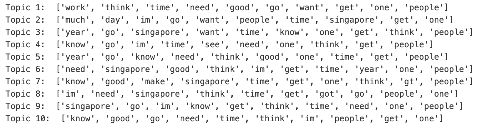
    <p><em>Figure 2: LDA Topics</em></p>
</div>

**Transition to BERTopic and Vader Sentiment Analysis**

Recognizing the limitations of LDA and SpaCy, we decided to transition to **Vader** for sentiment analysis and **BERTopic** for topic modelling.

- **Vader**: Unlike SpaCy’s general sentiment analysis model, Vader is specifically designed for social media text. It accounts for the informal language, slang, and even emoticons often found in Reddit comments, making it more accurate in identifying sentiment in this context (Hutto & Gilbert, 2014). We found that SpaCy’s sentiment analysis model was too rigid and generalised, leading to a less accurate classification of comments. Vader, on the other hand, provided more nuanced polarity scores and better handled informal language, aligning more effectively with our data. We classified comments that had a negative polarity score greater than 0.2 as being a toxic comment. This represented about 2.7% of the data. 

<div style="text-align: center;">
    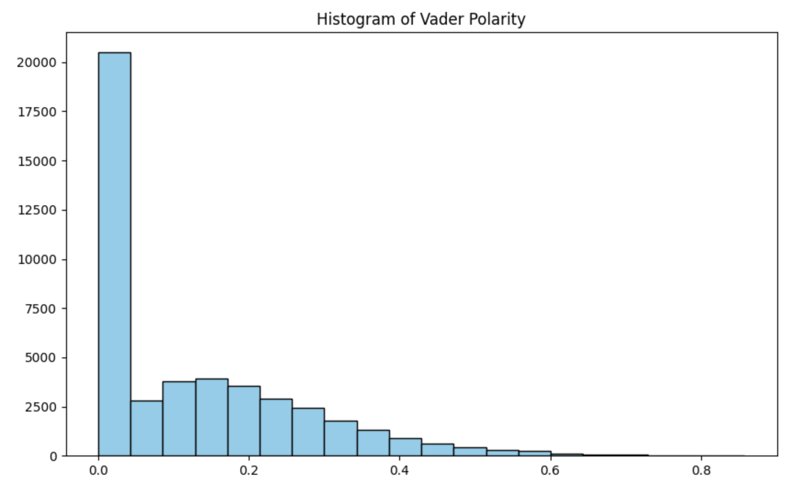
    <p><em>Figure 3: Histogram of Vader Negative Polarity Scores</em></p>
</div>

- **BERTopic**: BERTopic outperformed LDA by using contextual embeddings generated by transformers like BERT. These embeddings captured the more nuanced meanings in social media text and allowed for more meaningful clustering of topics. Moreover, BERTopic uses HDBScan, a density-based clustering method that performed better with the noisy and unstructured nature of Reddit comments (Grootendorst, 2020). The topics generated by BERTopic were much more coherent and picked up on local current affairs. 

<div style="text-align: center;">
    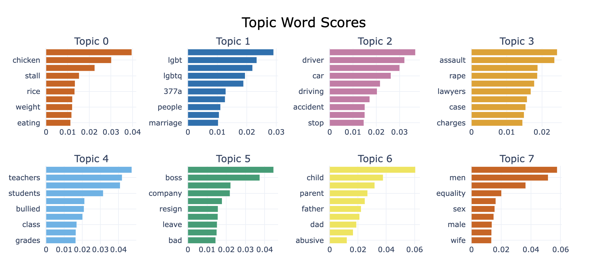
    <p><em>Figure 4: BERTopic Topics</em></p>
</div>

### 3.4 Results and Evaluation

*Jupyter Notebook:* `HDBSCAN Fine Tuning.ipynb`

*Dataset:* `data_2022_long.csv` and `data_2020_long.csv`

**BERTopic Tuning and HDBScan**

For this project, we aimed to find general, rather than specific topics in our data. For example, rather than finding topics such as “Football” or “Olympics”, we aimed to identify the broader topic of “Sports”. This is because broader topics are able to capture a larger proportion of Reddit comments. For clustering in BERTopic, we used HDBScan, which we tuned for the following parameters:

- **Min Cluster Size**: We experimented with values from 250 to 450, choosing 350 as the optimal size for capturing broad topic themes while maintaining cluster cohesion.
- **Min Samples**: We experimented with values from 5 to 20, choosing 20 as the optimal size to balance the need for reliable clusters without excluding too many comments.

The code below shows our setting up of the range of min cluster size and min sample values

```python
# Set up parameter distribution for tuning using grid search
min_cluster_sizes = [250, 300, 350, 400]
min_samples_values = [5, 10, 15, 20]
```
- **Other parameters**: We decided to keep default parameter options for computing distances (euclidean) and determining clusters (extent of mass). Euclidean distance is widely used for text data clustering due to its compatibility with vectorized representations (bertopic: embeddings). For Reddit’s text data, Euclidean effectively captures feature differences, making it a reliable choice without the need for alternative metrics. Reddit's content is dense and varied, with overlapping topics. The EOM method supports nuanced clustering and noise filtering, which aligns well with Reddit’s structured discussions and subtopics, generating clearer, major topic-oriented clusters.

**Evaluation Metric: HDBSCAN Relative Validity Index**

We used the HDBSCAN Relative Validity Index to evaluate cluster quality in BERTopic. The relative validity index, as implemented in HDBSCAN, measures the clustering's consistency by considering both intra-cluster density and inter-cluster separation in a comparative manner. This provides a quantitative metric that helps assess the relative validity of different clustering solutions without requiring prior knowledge of the number of clusters (Campello et al., 2013). This metric is particularly suitable for density-based clustering methods like HDBSCAN, as it can account for density variations while balancing computational efficiency.

Below is the specific code portion containing the relative validity index in our score() function used in fine-tuning:

```python
def score(self, X, y=None):
        # Calculate and return DBCV score as a performance measure
        if len(set(self.model.labels_)) > 1:  # Ensure it has more than one cluster
            return self.model.relative_validity_
        else:
            return -np.inf  # Assign a very low score if there's only noise
```
The validity index was preferred over traditional metrics like the silhouette score and coherence score, which are generally more suited for centroid-based clustering models such as k-means (Maas et al., 2021). These traditional metrics are less effective for density-based clustering algorithms, which can have clusters of varying shapes and densities. The validity index better aligns with the nature of HDBSCAN and offers a more reliable measure of clustering quality for such models. The chosen values for min_cluster_size and min_samples are the values that correspond to the highest validity index score (dbcv_score) relative to other combinations of parameter values.

The code below shows our tuning function, where we initiated the HDBSCAN model with metric='euclidean' and cluster_selection_method='eom', while tuning only min_cluster_size and min_samples. To save computational resources, we performed tuning on a 2.5% stratified sample of the dataset, based on comment year and subreddit source. Due to limited GPU and RAM, we focused on key parameters rather than exploring additional distance metrics and clustering methods, which would demand significantly more resources with high-dimensional Reddit data. Prior to tuning, we applied UMAP to reduce embedding dimensionality, ensuring that the optimal parameter values are based on meaningful text data features rather than noise. Additionally, we used `RandomizedSearchCV()` to sample parameter combinations efficiently, optimizing computational efficiency and managing memory and time constraints during fine-tuning.

```python
# Step 2: Reduce Dimensionality with UMAP
fitted_umap = umap.UMAP(n_components=5, n_neighbors=30, min_dist=0.0, random_state=42).fit(embeddings)
umap_embeddings = fitted_umap.embedding_
```
To tune HDBSCAN with `RandomizedSearchCV()`, we first need to create a custom wrapper class, `HDBSCANWrapper`, which includes the essential characteristics required for HDBSCAN to function as a model within `RandomizedSearchCV()`. This wrapper lets us define parameters and methods, ensuring compatibility with the requirements of `RandomizedSearchCV()`. We opted for this approach after testing both manual grid search and a custom randomized search function, which exceeded our computational resources during execution.

```python
# Step 1: Define a custom HDBSCAN estimator wrapper
class HDBSCANWrapper(BaseEstimator, ClusterMixin):
    def __init__(self, min_cluster_size=5, min_samples=5, metric='euclidean'):
        self.min_cluster_size = min_cluster_size
        self.min_samples = min_samples
        self.metric = metric
        self.model = None
    
    def fit(self, X, y=None):
        # Instantiate and fit HDBSCAN with the parameters
        self.model = HDBSCAN(
            min_cluster_size=self.min_cluster_size,
            min_samples=self.min_samples,
            metric=self.metric,
            cluster_selection_method='eom',
            gen_min_span_tree=True  # Ensures minimum spanning tree generation
        )
        self.model.fit(X)
        return self
    
    def score(self, X, y=None):
        # Calculate and return DBCV score as a performance measure
        if len(set(self.model.labels_)) > 1:  # Ensure it has more than one cluster
            return self.model.relative_validity_
        else:
            return -np.inf  # Assign a very low score if there's only noise
```
After creating the `HDBSCANWrapper`, we define the parameter distributions for `RandomizedSearchCV()` and set up `RandomizedSearchCV()` with the `HDBSCANWrapper` as follows

```python
# Step 2: Define parameter distributions for RandomizedSearchCV
param_dist = {
    'min_cluster_size': min_cluster_sizes,
    'min_samples': min_samples_values,
}

# Step 3: Set up RandomizedSearchCV with the custom HDBSCANWrapper
random_search = RandomizedSearchCV(
    estimator=HDBSCANWrapper(),
    param_distributions=param_dist,
    n_iter=10,  # Set the number of random configurations to try
    random_state=42, #Set seed for reproducibility
    n_jobs=-1  # Use all available processors
)
```
Finally, we perform the tuning on `umap_embeddings` and obtain the optimal min_cluster_size and min_samples values

```python
# Step 4: Perform the search on embeddings
search_results = random_search.fit(umap_embeddings)
# Step 5: Extract the best parameters and score
best_model = search_results.best_estimator_
best_params = search_results.best_params_
best_score = search_results.best_score_
```
We found that the optimal values were a minimum cluster size of 350 and a minimum samples value of 20, resulting in the highest relative validity index score of 0.31. Although this score is not close to 1 (the ideal relative validity index score), our primary objective was to identify a few dominant topics. This means our clusters encompass a large volume of comments, forming broader clusters rather than fine-grained, smaller ones. As a result, our approach may not yield the highest possible relative validity index score.

**Training and Embedding Strategy**

*Jupyter Notebook:* `Bertopic Modelling.ipynb`

*Dataset:* `data_2022_long.csv` and `data_2020_long.csv`

To optimise the runtime and manage Google Colab’s limitations, we pre-generated the embeddings for each year’s dataset. This allowed us to bypass the computationally expensive embedding process during each model run. By saving the embeddings, we could rerun BERTopic without recomputing the text embeddings, reducing the risk of interrupted sessions due to Colab timeouts (Devlin et al., 2019). 

We chose the all-MiniLM-L6-v2 model from SentenceTransformer is an efficient, compact model well-suited for generating high-quality sentence embeddings for semantic similarity tasks. Its architecture, designed to balance speed and accuracy, enables effective clustering and topic modeling with minimal resource use, which is ideal for real-time applications and large datasets (Reimers & Gurevych, 2020).

```python
# Embedding model chosen
sentence_model = SentenceTransformer("all-MiniLM-L6-v2")

# After embeddings were generated, we saved them as .npy files
np.save("flattened_embeddings_2020.npy", flattened_embeddings_2020)
np.save("flattened_embeddings_2022.npy", flattened_embeddings_2022)
```

**Running the optimal model and generating top 15 topics**

We ran our optimal BERTopic model on the rest of the dataset. Given limited GPU and RAM space, we ran the BERTopic model separately each year, and identified the top 15 topics of each year. This represented about 7-10% of the dataset.  

```python
#Best parameters
best_hdbscan = HDBSCAN(cluster_selection_method='eom', metric='euclidean',
        min_cluster_size=350, min_samples=20)

#Best bertopic model
topic_model = BERTopic(hdbscan_model=best_hdbscan)

#fit topic modelling to the preprocessed text data
topics, probabilities = topic_model.fit_transform(filtered_df["text"], np.array(filtered_embeddings))
```
For example, the topics identified for 2020 can be seen below. 
<div style="text-align: center;">
    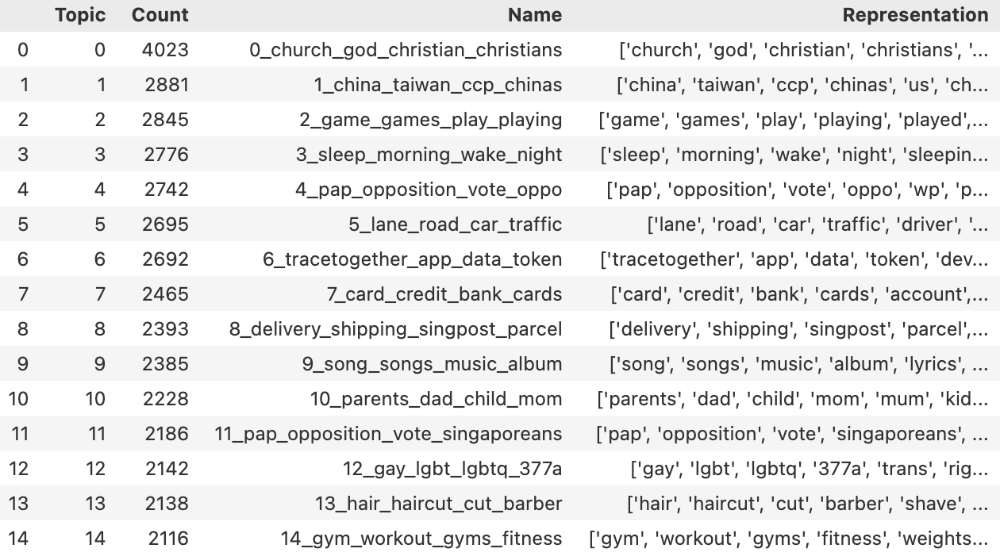
    <p><em>Figure 5: 2020 Top 15 Topics</em></p>
</div>

As BERTopic uses UMAP which is stochastic in nature, running the model may result in slightly different results as compared to the ones our team derived. To our model results, see `2020top15topics.csv`, `2021top15topics.csv`, `2022top15topics.csv` and `2023top15topics.csv` along with the corresponding datasets labelled with topics. 

## Section 4: LLM Methodology

### 4.1 Toxicity Definition

**What is toxic?**

Before examining and labelling the toxicity and hatefulness of comments, it is important to define these terms to ensure consistency and accuracy in labelling. Toxicity refers to content that is rude, disrespectful, or profane, including the use of slurs. Hatefulness is defined as content that expresses, incites, or promotes hate based on race, gender, ethnicity, religion, nationality, sexual orientation, disability status, or caste. In this project, we use toxicity models that combine both toxic and hateful elements in their output. Therefore, when we label a comment as toxic, it implies the presence of either toxicity or hatefulness.

### 4.2 Technical Assumptions

In this project, several technical assumptions influenced our LLM model selection and development process, including:

- **Data Preprocessing**: To ensure consistency with topic modelling, we worked on LLM models after processing the raw data in the same manner, including data cleaning and filtering of comments with more than 8 words. We assumed that the toxicity trend of comments with less than 8 words would not differ significantly with our current data selection. 

- **Sampling Methodology**: For sampling data to be manually labelled, we only sampled and stratified by subReddit thread from comments in 2022 and 2023. It was assumed that this sample would be representative and contain a substantial amount of toxic comments for us to differentiate LLM models’ performance and select the best one based on the metric we chose.

- **Comparison of Selected Topics**: To continue on toxicity analysis, we ran LLM on the data with topics labelled by NLP. As the top 15 topics were chosen for each year, there were some variations in the sub-topics selected across time. For example, under the transport category, buses and cars were chosen in some years while flights and cycling could appear in others. We assumed that these variations would not introduce bias or alter the overarching trends in our subsequent analysis.

### 4.3 Labelling Mechanism

**Rule-based Labelling**

Given that our dataset is sourced from Singapore’s main threads, where comments often include Singlish words and acronyms, we face challenges in adopting pretrained models that are not fine-tuned to detect toxic Singlish expressions. This language-specific variation means that toxic comments in Singlish may go undetected, as these models may not recognise such terms accurately. To bridge this gap, we developed a rule-based approach called the Singlish Toxic Dictionary, which includes a curated list of common toxic words in Singlish.
Before using the LLM model, each comment is checked against this dictionary. If a comment contains any toxic Singlish words, it will immediately be labelled as 'toxic.' Comments that remain unlabelled after this initial check are then processed by the pretrained model. This two-step approach improves the detection of toxicity in Singlish content, ensuring a more thorough and culturally relevant labelling process.


```python
singlish_toxic_dict = ['ahbeng', 'ahlian', 'baka', 'bloody hell', 'bloody idiot', 'bodoh', 'bo liao','buay pai seh', 'buay tahan', 'cb', 'cb kia', 'cb knn', 'cb', 'cb lao jia', 'cb lao knn', 'cb lor', 'cb sia', 'cb sia kia', 'ccb', 'chbye kia', 'chao chbye', 'chao chee bye', 'chow chibai', 'chow kar', 'chow tu lan', 'cibai', 'dumb ass', 'dumb', 'fuck', 'fuck you', 'fking', 'fucker', 'fucker sia', 'gila babi', 'gundu', 'hao lian kia', 'hopeless', 'idiot', 'idiot', 'ji bai', 'jiat lat', 'jialat kia', 'jibai', 'joker', 'kan', 'kan ni na', 'kena sai', 'kia si lang', 'knn', 'knn cb kia', 'knnccb', 'knnbccb', 'kns', 'kns cb', 'lampa', 'lan pa', 'lanjiao', 'lanjiao kia', 'lj', 'loser', 'nabei', 'no use kia', 'noob', 'pok gai', 'pui', 'sabo kia', 'sibei jialat', 'sibei sian', 'si gina', 'siol', 'slut', 'siao lang', 'stupid', 'suck', 'sua gu', 'tmd', 'tiok knn', 'tiok tiam', 'useless', 'what knn', 'what the fuck', 'wtf', 'wu liao kia', 'you die ah', 'you die']
```

**Manual Labelling Mechanism**

To help us identify the best-performing model for our dataset, we first aimed to test and compare all shortlisted LLM models on a labelled sample. For this, we manually labelled 200 comments, categorising them as toxic (marked as 1) or non-toxic (marked as 0) based on our toxicity criteria. This approach allowed us to evaluate model performance before applying the best model to the remaining dataset.

**Sampling for Manual Labelling**

*Jupyter Notebook:* `Get_Manual_Labelling_Data.ipynb`

*Dataset(before):* `Reddit-Threads_2022-2023.csv` and `cleaned_data_2223.csv`

*Dataset(after):* `manual_label_sample.xlsx`

Random sampling stratified by subreddit threads is performed on the cleaned `Reddit-Threads_2022-2023.csv`. Proportion of comments for each subreddit thread is calculated and used for determining the number of comments to be included in the manual sample, with rSingaporeRaw accounting for approximately 18% of total comments, 2% for rSingaporeHappening, and 80% for rSingapore. This ensures that the sampled data reflects the proportion of each subReddit thread in the whole dataset adequately. Note that due to minor discrepency in data cleaning in the earlier stage of the project, the `manual_label_sample.xlsx` may not be reproduced by the current `cleaned_data_2223.csv`.


### 4.4 Experimental Models

Given the variety of pre-trained toxic detection models available, the question arose as to which model would be most effective for our purposes. Therefore, we explored and experimented with several models, including Google Jigsaw's Perspective, the VADER sentiment analysis tool, and various BERT-based models.

**Perspective**

*Jupyter Notebook:* `Perspective_Labelling.ipynb`

*Dataset:* `manual_label_sample.xlsx`

Perspective provides a tool for assessing the potential impact of comments on a conversation, with attributes like *TOXICITY* and *IDENTITY_ATTACK*. This model outputs a probability score between 0 and 1, where a higher score indicates a greater likelihood of the comment exhibiting the specified attribute.

<u>Implementation</u>

After obtaining an API key, we configured a client to interact with Perspective’s comment analysis model. We structured each request to include the comment text, specify the language, and request scores for the attributes *TOXICITY* and *IDENTITY_ATTACK*—in line with our definition of toxicity, which covers both toxicity and hatefulness elements. Upon receiving the response, we parsed it to extract scores for each attribute and experimented with different threshold values to classify comments accurately. For example, if the *TOXICITY* or *IDENTITY_ATTACK* score exceeds 0.3, the comment is labelled as *toxic*. Else, the comment is classified as *non-toxic*.

```python
# API call for TOXICITY and IDENTITY_SCORE scores
def get_toxicity(text):
    url = f"https://commentanalyzer.googleapis.com/v1alpha1/comments:analyze?key={API_KEY}"

    # Data to send to the API
    data = {
        'comment': {'text': text},
        'languages': ['en'],
        'requestedAttributes': {
            'TOXICITY': {},
            'IDENTITY_ATTACK': {}
        }
    }

    # Send request to API
    response = requests.post(url, data=json.dumps(data), headers={'Content-Type': 'application/json'})

    # Check for success and return result
    if response.status_code == 200:
        result = response.json()
        toxicity_score = result['attributeScores']['TOXICITY']['summaryScore']['value']
        identity_attack_score = result['attributeScores']['IDENTITY_ATTACK']['summaryScore']['value']
        return toxicity_score, identity_attack_score
    
    else:
        print(f"Error: {response.status_code}, {response.text}")
        return None
    
# To avoid hitting rate limits
def toxicity_delay(text):
    time.sleep(1)  
    return get_toxicity(text)

# Label toxicity
def label_toxicity(df, t):
    # Create a copy of the DataFrame within the function
    df_copy = df.copy()

    # Iterate over rows and label based on toxicity thresholds
    for index, row in df_copy.iterrows():
        if pd.isnull(row['result']):  # If result is None, check toxicity
            scores = toxicity_delay(row['text'])

            if scores is not None:
                toxic_score, identity_attack_score = scores

                # Set threshold for toxicity
                if toxic_score > t or identity_attack_score > t:
                    df_copy.at[index, 'result'] = 'toxic'
                else:
                    df_copy.at[index, 'result'] = 'non-toxic'
    
    return df_copy  # Return the modified copy
```

**Vader**

*Jupyter Notebook:* `Vadar_Labelling.ipynb`

*Dataset:* `manual_label_sample.xlsx`

Vader is a lexicon and rule-based text sentiment analysis tool that is specifically attuned to sentiments expressed in social media, making it a well-suited LLM model in analysing Reddit comments. It is the simplest and fastest model among the three. We were curious to see how the sentiment-based model would perform in this case, even though the model itself was not designed to identify toxic comments.

<u>Implementation</u>

- **Vader Model Selection**: We used the C.J. Hutto’s version of Vader model and retrieved polarity score from the model’s output. This version included customised negation words, idioms, and degree adverbs to modify or scale the original Vader score (Hutto, C.J. & Gilbert, E.E, 2014). It assigns a score between 0 and 1 to “negative”, “neutral”, and “positive” respectively for each target text. A compound score is then computed based on these 3 subscores, with a range of -1 to 1. A more negative score indicates a more intense negative sentiment.

```python
analyzer = SentimentIntensityAnalyzer() # C.J. Hutto's Implementation can be found in Vadar_Labelling.ipynb

def get_sentiment_scores(text):
    return analyzer.polarity_scores(text)

# Apply the sentiment analysis function to the 'text' column
sentiment_results = labelled['text'].apply(get_sentiment_scores)
```
- **Classification Thresholds for Toxicity**: The final compound score was compared against a threshold when labelling toxic comments. We explored thresholds from -0.4 to -0.8 and classified comments as toxic if the score was lower than the threshold.


**Huggingface Models**

*Jupyter Notebook:* `huggingface.ipynb`

*Dataset:* `manual_label_sample.xlsx`

To identify the most effective Hugging Face model for toxicity classification, we initially tested a diverse set of 13 models on our manually labelled sample. This selection included both models specifically trained for toxic comment detection and general sentiment analysis models, enabling us to compare performance across different types of language models. The list of tested models is as follows:

1. **Toxic Comment Classifiers**:

    - unitary/toxic-bert
    - unitary/unbiased-toxic-roberta
    - pykeio/lite-toxic-comment-classification
    - martin-ha/toxic-comment-model
    - JungleLee/bert-toxic-comment-classification
    - ZiruiXiong/bert-base-finetuned-toxic-comment-classification
    - longluu/distilbert-toxic-comment-classifier
    - prabhaskenche/toxic-comment-classification-using-RoBERTa

2. **General Sentiment Analysis Models**:

    - cardiffnlp/twitter-roberta-base-sentiment
    - roberta-base
    - bert-base-uncased
    - nlptown/bert-base-multilingual-uncased-sentiment
    - siebert/sentiment-roberta-large-english

Through preliminary testing, we observed that only three model general sentiment models: `unitary/toxic-bert`, `pykeio/lite-toxic-comment-classification` and `unitary/unbiased-toxic-roberta` showed consistent results suitable for our toxic classification task, with the first two performing best. The general sentiment analysis models often struggled to accurately detect nuanced toxic language, highlighting the advantage of using specialised toxic classifiers. Based on these findings, we narrowed our focus to the top 3 toxic comment classifiers, picking the one with the strongest metrics.

<u>Implementation</u>

- **Dynamic Text Chunking for Model Compatibility**: To accommodate each model’s maximum token limit of 512 tokens, we divided longer text entries into smaller segments, or “chunks.” This chunking approach allowed each model to process lengthy entries effectively without losing context. For each entry, the model calculated a toxicity score for each chunk, and these scores were averaged to generate a final toxicity score.

```python
def classify_toxicity_by_dynamic_chunks(text, tokenizer, classifier, max_length=512):
    try:
        inputs = tokenizer(text, return_tensors="pt", truncation=False)
        input_ids = inputs['input_ids'][0]
        total_tokens = len(input_ids)

        if total_tokens <= max_length:
            num_chunks = 1
            chunk_size = total_tokens
        else:
            num_chunks = math.ceil(total_tokens / max_length)
            chunk_size = math.ceil(total_tokens / num_chunks)

        toxicity_scores = []

        for i in range(num_chunks):
            start = i * chunk_size
            end = min((i + 1) * chunk_size, total_tokens)
            chunk = tokenizer.decode(input_ids[start:end], skip_special_tokens=True)
            result = classifier(chunk)
            toxicity_scores.append(result[0]['score'])

        return sum(toxicity_scores) / len(toxicity_scores)
    except Exception as e:
        print(f"Warning: Error processing text chunk: {str(e)}")
        return 0.0
```

- **Classification Threshold for Toxicity**: To classify entries as *toxic* or *non-toxic*, we experimented with thresholds ranging from 0.1 to 0.9 in increments of 0.1. For each threshold, we generated predicted labels based on the model's toxicity scores in order to compare these predictions against our manually labelled data. Entries with scores above the chosen threshold were ultimately labelled as "toxic," while those below were classified as "non-toxic."

**Confusion Matrics and Evaluation Metrics**

*Jupyter Notebook:* `Perspective_Labelling.ipynb`, `Vadar_Labelling.ipynb` and `huggingface.ipynb`

*Dataset:* `manual_label_sample.xlsx`

To determine which model performed best for toxicity detection, we generated confusion matrix values, including True Positives (TP), False Positives (FP), True Negatives (TN), and False Negatives (FN), for each Hugging Face model, along with two additional models, VADER and PerspectiveAI. 

<u>Metric Selection: Emphasis on Recall</u>

Instead of focusing solely on accuracy, we prioritised recall as our primary metric. This decision was based on the importance of minimising false negatives in toxicity detection. Given the context of this task, it is preferable to classify a non-toxic comment as toxic (false positive) than to miss labelling a toxic comment (false negative). High recall indicates that a model effectively identifies toxic content, even if some non-toxic content is incorrectly flagged as toxic.

In this context:

- **Recall** = TP / (TP + FN), measuring the model’s ability to correctly identify toxic comments.

- **Precision** and **accuracy** were also evaluated, but they held secondary importance compared to recall.

**Choosing the Model**

To select the final model for toxicity labelling, we compared the recall values across different experimental models. For Perspective, the threshold tested ranged from 0.2 to 0.5, as we found that values below 0.2 or above 0.5 did not improve the results. For Vader, thresholds between -0.4 and -0.8 were tested for classifying toxic comments. For the Hugging Face models—`unitary/toxic-bert` and `pykeio/lite-toxic-comment-classification—thresholds` from 0.1 to 0.9 were applied. The best performing thresholds for each model were 0.2, -0.4, 0.1, and 0.1 for Perspective, Vader, `toxic-bert`, and `lite-toxic-comment-classification`, respectively.

Upon comparing the performance across different models, we observed notable differences in both recall scores and computational efficiency.

While Perspective produced the highest recall score, it was highly time-consuming. Labelling 200 comments took approximately 5 minutes, making it difficult to scale, especially with a large volume of text data. This limitation was primarily due to the Queries Per Second (QPS) quota imposed by the API, which was capped at 1. Although we attempted to request an increase in the QPS, the tradeoff between improved speed and the project's timeline made it clear that this approach would not be feasible for our needs.

Vader, despite having the lowest recall score, was also deemed unsuitable for toxicity labelling. This is because it tends to score text based mainly on sentiment. For example, texts expressing negative emotions like sadness are likely to receive highly negative scores, even though they are not necessarily toxic in nature. This made Vader less reliable for our purpose.

In contrast, `unitary/toxic-bert` with a threshold of 0.1 emerged as the second-best performing model, with a recall score in the range of 0.65 to 0.75. While it did not outperform Perspective in recall, it offered a significantly faster processing time, making it more suitable for our project timeline. This recall range is adequate given our use case, as it reduces over-flagging of non-toxic content without requiring an extremely high threshold, which would be essential for more high-stakes applications like banking fraud detection. Although this threshold may introduce some false positives, its effectiveness in consistently detecting toxic content outweighs these drawbacks. Given its balance of performance and efficiency, we selected unitary/toxic-bert at a threshold of 0.1 as our final toxicity labelling model.

|          | Perspective (0.2) | Vader (-0.4)     | unitary/toxic-bert<br>(0.1)  | pykeio/lite-toxic-comment-<br>classification (0.1)
| -------- | ----------------- | ---------------- | ---------------------------- | ------------------- |
| Recall   | 0.73              | 0.48             | 0.65                         | 0.63                |


### 4.5 Labelling Toxicity

To uncover insights on overall toxicity trends, and identify specific topics contributing to rising toxicity levels, we apply our chosen model on the entire dataset and the sample curated by the NLP team.

**Whole Dataset**

*Jupyter Notebook:* `bert_colab.ipynb`

*Dataset:* `cleaned_data_2223.csv` and `cleaned_data_2021.csv`

After deciding on the final model, we run unitary/toxic-bert with a threshold at 0.1 on the whole Reddit dataset from Jan 2020 to Oct 2023 to investigate the general toxicity trend. These are cleaned data with comments more than 8 words to align with the NLP team’s data for a fairer comparison. 

```python
# Load the tokenizer and model
tokenizer = AutoTokenizer.from_pretrained(model_name)

# Create the pipeline
classifier = pipeline('text-classification', model=model_name, top_k=None, device=0, batch_size=8)

labels = []
# Loop through each row in the dataframe
for index, row in df_sample.iterrows():
    text = row['text']

    if any(word in text for word in singlish_toxic_dict):
        predicted_label = "toxic"

    else:
        # Get toxicity score for the text
        toxicity_score = classify_toxicity_by_dynamic_chunks(text, tokenizer, classifier)

        # Classify the toxicity score based on the threshold
        predicted_label = classify_toxicity_score(toxicity_score, threshold=0.1)

    df_sample.at[index, 'predicted_label'] = predicted_label

# Save the updated DataFrame with labels to a new CSV file
output_file_path = '/content/drive/My Drive/Colab Notebooks/cleaned_data_2223_labelled' + str(start_index) + '-' + '.csv'
df_sample.to_csv(output_file_path)
```

**NLP Output**

*Jupyter Notebook:* `bert_colab.ipynb`

*Dataset (before):* `2020_comments_top15topics.csv`, `2021_comments_top15topics.csv`, `2022_comments_top15topics.csv`, `2023_comments_top15topics.csv`

*Dataset (after):* `2020_comments_top15topics_labelled.csv`, `2021_comments_top15topics_labelled.csv`, `2022_comments_top15topics_labelled.csv`, `2023_comments_top15topics_labelled.csv`

Similarly, after receiving the top 15 common topics from each year from the NLP team, we ran the `unitary/toxic-bert` to label toxicity. We then decided to narrow down the topics for deeper analysis. Although some topics overlapped across the years, we were unable to automatically merge them due to the specificity of the content in the output. For example, a topic might be labelled as "1_football_games_sports_players" with associated terms given as ['football', 'games', 'sports', 'players', 'team', 'badminton', 'athletes', 'gt', 'world', 'gold']. As a result, we manually classified such topics into broader categories; in this case, labelling it under *"Sports"*.

We then conducted a final classification on a Miro board to better visualise the groupings. From this board (Figure 6), we observed that certain topics only contained data from a single year. Such topics were deemed less meaningful for analysis, as they lacked relevance across multiple years. Instead, we prioritised groupings with data spanning 3 to 4 years, indicating sustained topic relevance. This approach aligns with our objective of deriving useful and impactful insights for recommendations. Ultimately, we focused on the following nine categories: *Religion, SG Politics, Covid, Sports, Housing, Music, Gaming, Transport, and Media.* Then, we relabelled the data according to the nine categories.

*Jupyter Notebook:* `Topic_Relabelling.ipynb`

*Dataset:* `2020_comments_top15topics_labelled.csv`, `2021_comments_top15topics_labelled.csv`, `2022_comments_top15topics_labelled.csv`, `2023_comments_top15topics_labelled.csv`

<div style="text-align: center;">
    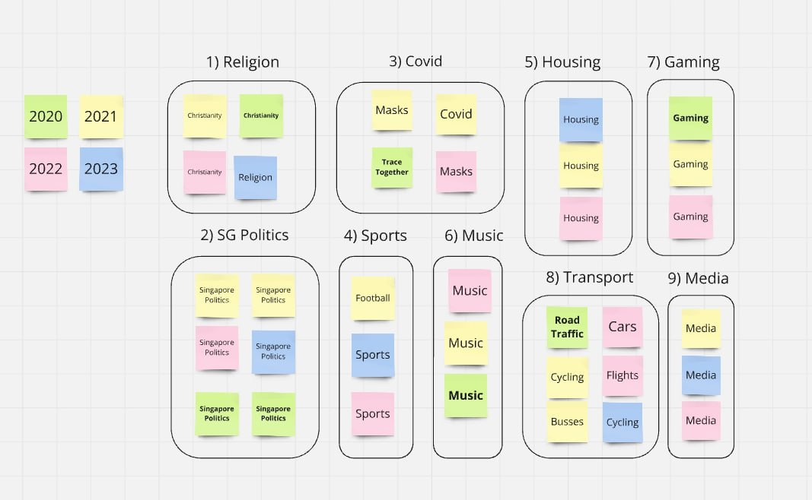
    <p><em>Figure 6: 2020-2023 Final Top 9 Topics</em></p>
</div>

### 4.6 Graphical Analysis

To help identify trends and gain further insights from our results, we visualised the data using line graphs:

*Jupyter Notebook:* `Plot_Whole.ipynb`

*Dataset:* `labelled_data_whole.csv`

- **Overview Graph**: This visualisation illustrates the trend in toxicity over time, plotting the monthly proportion of toxic comments from January 2020 to October 2023. We grouped data by month, calculating the proportion of toxic comments respectively to observe any long-term trends or seasonal fluctuations.

- **Hourly Graph**: To examine the daily pattern of toxicity, we grouped data by the hour of the day and plotted the proportion of toxic comments per hour. This reveals patterns in toxicity that may correlate with specific times of day, helping us understand when toxic interactions tend to peak.

*Jupyter Notebook:* `Plot_9_Topics.ipynb`

*Dataset:* `topic_relabelled_full.csv`

- **Proportion of Toxic Comments – Chosen 9 Topics**: We created graphs to compare the proportion of toxic comments for our refined selection of 9 topics against the overall trend. Grouping data by month and calculating the proportion of toxic comments respectively, this approach ensures that our focus on the selected 9 topics adequately captures the primary patterns observed across all topics.

- **Proportion of Toxic Comments – Societal & Governance vs. Entertainment Categories**: To improve clarity and draw meaningful comparisons, we organised topics into two broad categories:

    - *Societal & Governance:* This category covers topics of high societal importance and public focus, including Religion, Singapore Politics, Covid, Transport, and Housing.

    - *Entertainment:* This category includes lighter, more recreational topics like Sports, Music, Gaming, and Media.

- Dividing the topics into these categories reduces overcrowding in the graphs and highlights contrasts between discussions with varying levels of public and government focus.

For each category, we grouped data by month and computed the proportion of toxic comments for each topic by dividing the number of toxic comments by the total comments for that topic in the month. Additionally, we applied a 3-month rolling window to the data to smooth out short-term fluctuations, providing a clearer view of sustained trends over time.


## Section 5: Frontend 

We developed a frontend dashboard interface for our toxic comment analysis to enhance usability and interpretability for non-technical end users, such as policy makers. Key functions of this dashboard include adjustable date and topic filters, which allow users to tailor their search to specific periods or topics of interest. The frontend generates interactive graphs that visually represent trends in toxic comment frequency, providing an overview of levels of toxicity and hate over time. If policy makers wish to take a closer look at the actual toxic comments, they can use the ‘Toxic Comment’ feature to retrieve toxic comments from a specified topic and chosen month, allowing for further analysis. 

This dashboard allows end users to easily obtain an understanding of the levels of toxicity and hate in the most popular Reddit topics and take a deep dive into specific time periods and topics, making the tracker a valuable tool for maintaining online community standards. 

To run the frontend dashboard, run `streamlit run app.py` in your terminal. It requires the `topic_relabelled_full.csv` dataset.

## Section 6: Findings

### 6.1 Results

<div style="text-align: center;">
    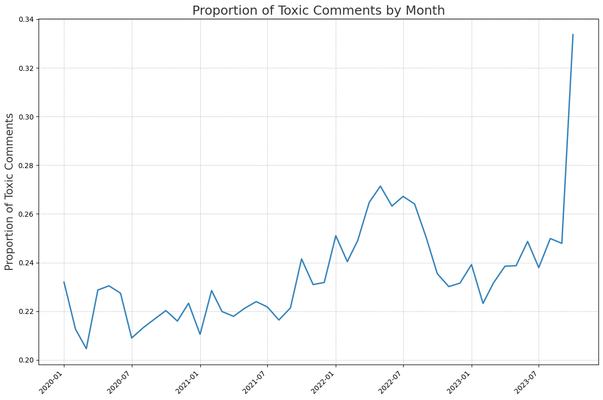
    <p><em>Figure 7: Toxicity Trend by Month</em></p>
</div>

The overview plot reveals that Reddit has grown increasingly toxic and hateful over recent years, with a noticeable spike in the first half of 2022 and a sharp increase in the second half of 2023. By this period, approximately one in every three comments was labelled as toxic by our model.

<div style="text-align: center;">
    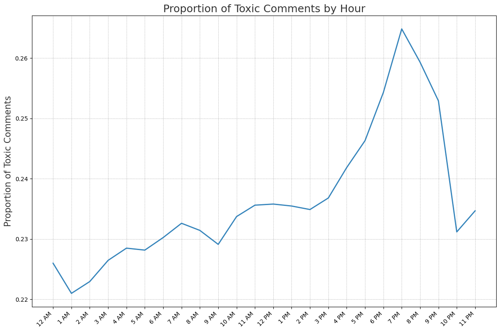
    <p><em>Figure 8: Toxicity Trend by Hour</em></p>
</div>

From the hourly graph, we observed a notable rise in toxicity and hatefulness throughout the day, peaking at around 7 pm before tapering off in the evening.

<div style="text-align: center;">
    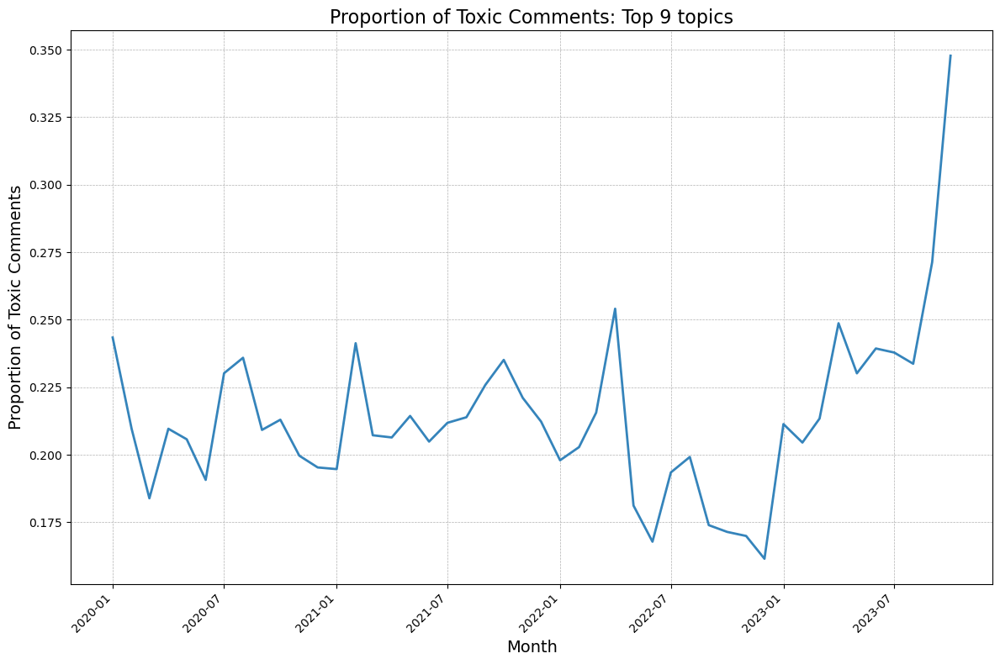
    <p><em>Figure 9: Toxicity Trend Top 9 Topics</em></p>
</div>

The Proportion of Toxic Comments graph for the chosen 9 topics aligns closely with the overall toxicity trend in the overview graph, with minor deviations in the scale dip observed in late 2021 and 2022 . These minor differences aside, the alignment confirms that our selected categories sufficiently represent the broader toxicity trends, validating their relevance for further analysis.

<div style="text-align: center;">
    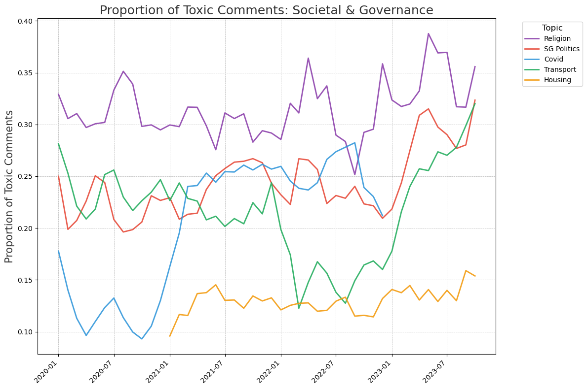
    <p><em>Figure 10: Toxicity Trend Societal & Governance</em></p>
</div>

<div style="text-align: center;">
    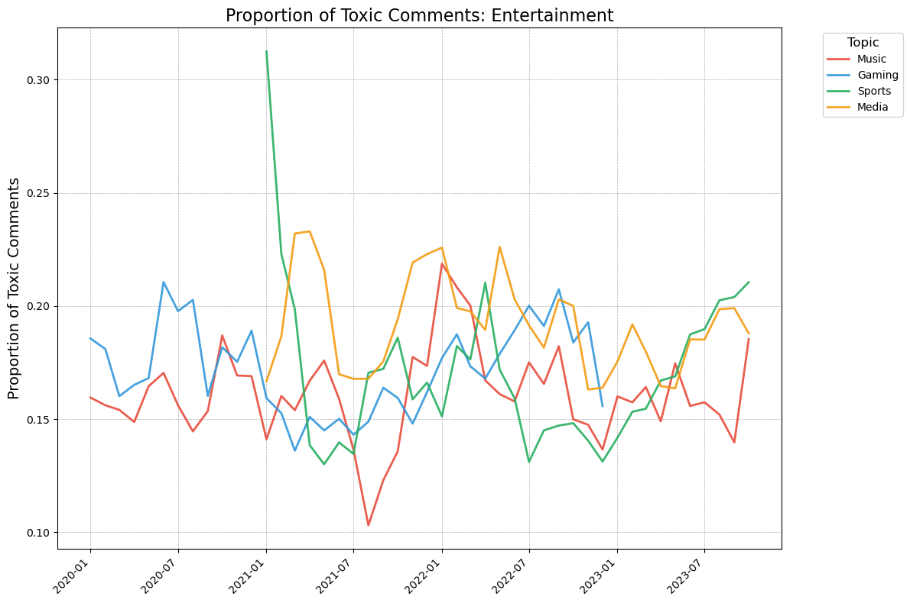
    <p><em>Figure 11: Toxicity Trend Entertainment</em></p>
</div>

Key Observations:

- Religion consistently shows the highest proportion of toxic comments from 2020 to 2023.
- Topics such as Singapore Politics, Transport, Sports, and Music display an overall rising trend in proportion of toxic comments over time.
- A spike in the proportion of toxic comments related to Covid-19 emerged in late 2020, which coincided with tighter government restrictions and debates over mask enforcement, likely reflecting pandemic fatigue and frustration with ongoing restrictions as the situation slowly improved. Its decline in the last quarter of 2022 followed by its disappearance from the Top 15 comments in 2023 also aligns with the easing of Covid-19 policies like mask wearing.
- The rise in the proportion of toxic comments for gaming throughout 2021 and 2022 may be attributed to the sudden boom of the gaming industry throughout the lockdown period, including major gaming leagues triggering online debates. 
- The proportion of toxic comments for entertainment topics fluctuated over the years, with a significant peak for sports at the start of 2021.


### 6.2 Discussion

Based on our key findings, we focused our deeper analysis on four topics: **Religion**, **SG Politics**, **Transport**, and **Sports**. These topics were selected due to their high levels of toxic commentary and a rising trend, indicating a need for potential policy intervention. This targeted approach enables us to provide actionable insights for the policy team to address these immediate issues.

To support this, we examined toxic comments within each topic to understand the underlying drivers behind the trends, especially the rising one. By analysing the recurring themes in toxic posts, we aim to highlight the root causes of increased hostility and pinpoint areas where policy changes could help mitigate the issues.

**Religion**

Among the religious topics analysed, discussions around religion show notable fluctuations from 2020 to 2023, with a significant peak in the first half of 2023, reaching the highest level of toxicity in October. The data indicates that religious topics exhibit the highest proportion of toxic comments compared to other topics. Notably, much of the discourse centres on Christianity, Islam, and their practices, as well as debates between atheists and non-atheists, Christian perspectives on LGBTQ+ issues, and publicised cases of alleged hypocrisy and misconduct among religious leaders.

The elevated toxicity in early 2023 can be partially attributed to the debates following the **repeal of Section 377A** in January, which sparked discussions on the intersection of religious beliefs and LGBTQ+ rights, particularly around the question of whether LGBTQ+ identities are considered sinful by some religious interpretations. The **Ministry of Home Affairs’ emphasis on religious harmony** in March 2023 also fueled conversations, as authorities highlighted the need for sensitivity to avoid religious tension. These calls for harmony generated diverse reactions, with some users questioning the balance between religious freedoms and inclusivity in Singapore’s pluralistic society.

Additional spikes in mid 2020 is attributed to significant discourse at the intersection of LGBTQ+ issues and religion, notably involving a female figure, Pastor Pauline Ong. She is a pastor at the Free Community Church (FCC), Singapore's only publicly LGBTQ-affirming Christian congregation. Alongside Pastor Miak Siew, the first ordained openly gay minister in the country, Pastor Ong leads FCC in providing a spiritual home for LGBTQ+ individuals. This has spiked controversies regarding Christian beliefs and practices.

**SG Politics**

In politics, data show a general increase in toxicity from 2020 to 2023, with notable peaks in the latter half of 2021 and a significant rise in early 2023, reaching the highest levels in October. Political discussions emerged as the second most toxic topic, just below religion, largely driven by a series of high-profile controversies and scandals.

A peak in toxicity was observed in the second half of 2021, coinciding with the incident involving Workers’ Party MP Raeesah Khan, who admitted to lying in Parliament about accompanying a sexual assault survivor. This incident ignited intense debates around political accountability and integrity, particularly concerning the Workers’ Party’s handling of the matter. As the public became increasingly vocal, discussions turned critical, highlighting perceived gaps in political transparency and ethical standards.

In early 2023, there was another surge in toxic commentary, reaching unprecedented levels in October. This rise corresponded with multiple political scandals involving high-profile extramarital affairs among political figures, including PAP Speaker Tan Chuan-Jin and MP Cheng Li Hui, as well as Workers' Party members Leon Perera and Nicole Seah. Additionally, the Ridout Road property rental controversy, involving PAP ministers K. Shanmugam and Vivian Balakrishnan, fueled public discourse around conflicts of interest and transparency in government. These events intensified scrutiny of Singapore’s political landscape, driving public frustration and scepticism toward both ruling and opposition parties.

Beyond specific scandals, a large portion of toxic comments reflected general disgruntlement toward the PAP, with frequent criticisms alleging gerrymandering practices and ineffective policies. Comments often expressed outright hatred toward the PAP, support for the Workers’ Party, and dissatisfaction with the country’s direction under current governance. These sentiments suggest widespread frustration with the political status quo and a perception that alternative leadership might better address public grievances.

**Transport**

Among the societal and governance topics analysed, transportation demonstrates significant variability and generally maintains a moderate but concerning level of toxic commentary, which has been on the rise over the recent year. The initial peak observed in 2020 corresponds with an increase in road accidents involving various road users—pedestrians, motorcyclists, cyclists, and cars. The discourse was mainly about road safety, reckless driving, and pedestrian responsibility and further intensified by a controversial petition suggesting a six-month car ban, which spurred heated discussions. 

The trend of toxic commentary surrounding transportation continues to fluctuate until the end of 2021, which includes the increased use of e-bikes following the ban on personal mobility devices (PMDs) on footpaths. This shift led to rising frustrations among road users, particularly concerning safety risks posed by e-bikes. A notable peak toward the end of 2021 also reflects public reaction to the government's stricter regulations on cyclists' behaviour. This regulation ignited debate, with many voicing either support or dissatisfaction.

However, the notable drop in toxicity from late 2021 into early 2022 seems counterintuitive, given a slight increase in reported traffic accidents as per the Singapore Police Force's Annual Road Traffic Situation 2022. However, this dip might be explained by a shift in public focus toward other social issues, including religion, politics, and housing, which all experienced rises in toxicity during this period shown on the graph.

Finally, the transportation-related toxicity shows an upward trend from mid-2022, which appears to persist into late 2023. This aligns with recent reports highlighting an increase in both fatal and non-fatal traffic accidents. Upon examination, discussions reveal heightened tension among various road users, particularly with regards to cyclists' actions on public roads. This ongoing trend suggests that road safety remains a contentious issue, fueling an ever-growing proportion of toxic comments which warrant action from the government. 

**Sports**

Among the 4 topics in entertainment, sports has the highest variability and seems to exhibit a periodic upward trend. The proportion of toxic comments peaked in January 2021, where over 30% of the comments were flagged to be toxic by our model. Upon closer examination, there were a significant number of complaints about difficulties in booking badminton courts. In February 2021, SportsSG responded by clamping down on reselling of public sports facility booking, as some organisers were caught reselling court bookings to players for profit. However, the issue remained over the years as people wrote scripts and used bots to secure booking, making the process extremely competitive and hindering the accessibility of these facilities to the public.

The subsequent spike in toxicity occurred in early 2022, when news of national athletes missing out on Asian Games spurred discussion on the effectiveness of Singapore National Olympic Council (SNOC), Football Association of Singapore (FAS), and problems that persisted in the sports ecosystem. Similarly in the latter half of 2023, controversies surrounding national athletes and the local sports scene, especially football were brought up frequently again.

The poor performances of local football leagues have been frequently discussed throughout the years. The core issue lies in the lack of efforts in creating a vibrant sports culture and supporting talented individuals to pursue sports as a career. The government passed an amendment in July 2023 to re-evaluate its sports management and planned to commit to clear and achievable goals for sporting success. However, the public remains sceptical as more concrete policies and reforms are needed.


### 6.3 Recommendations

**Social Media Platforms**

Given the increasing prevalence of toxic comments, particularly in contentious areas like Religion and rising issues in Singapore Politics, Transport, Sports, and Music, we recommend the policy team advise social media platforms to strengthen their moderation measures. This could include:

- Enhanced Content Moderation: Platforms should apply stricter moderation protocols for the identified topics, using automated and manual review processes to address potentially harmful content promptly.

- Peak Time Moderation: Toxicity peaks between 6pm and 10pm; therefore, platforms could benefit from allocating additional resources during these hours to manage increased comment volumes and toxicity levels effectively.

**Policy Team (Governmental Issues)**

In light of the insights gathered from our focus on the topics of Religion, SG Politics, Transport, and Sports, we recommend the policy team further investigate the root causes of the rising toxicity in these areas. This would allow for a more informed approach to addressing public concerns and mitigating online hostility. However, some immediate targeted actions could include:

**Religion**

We recommend that the government take a proactive approach to promote interfaith understanding and harmony by incorporating religious education into the school curriculum. While Singapore has made significant efforts to foster racial harmony through initiatives like Racial Harmony Day, there has been less emphasis on promoting understanding and tolerance among different religious groups. By introducing age-appropriate lessons on different religions, their practices, and their core values, schools can help students develop a better understanding for the diverse religious landscape in Singapore and help prevent the formation of prejudices and stereotypes, promoting a more inclusive and tolerant society, both online and offline.

In addition to formal education, we recommend implementing policies that encourage constructive dialogue and respectful engagement, such as enhanced monitoring and moderation of online platforms to prevent hate speech and misinformation while protecting freedom of expression. The government can also support community-led interfaith dialogues and events that bring together people from different religious backgrounds to share their experiences and perspectives, helping to break down barriers and foster mutual understanding and respect. Digital literacy campaigns, particularly targeted at younger audiences, can further promote responsible online behaviour and critical thinking when encountering sensitive topics.

**SG Politics**

We recommend policies to strengthen transparency and accountability in politics by implementing clear guidelines for conflict of interest cases, establishing robust mechanisms for ethical compliance, and enhancing public communication around policy reforms. Such measures aim to rebuild trust in Singapore's political institutions and address public concerns related to integrity and governance. Additionally, these actions can help reduce online toxicity in religious discussions, promote a balanced approach to free expression, and foster religious harmony in a diverse society. 

**Transportation**

It is essential for the government to enforce stricter traffic rules and promote careful driving habits to curb the increasing number of traffic accidents. However, given the involvement of diverse stakeholders—drivers, cyclists, pedestrians, and e-bike users—each with distinct needs and challenges, these measures must be implemented thoughtfully. A balanced approach that carefully considers each group’s concerns is crucial to avoid unintended conflicts. Regulations should also be crafted to clearly justify and address specific wrongdoing, ensuring that any penalties are fair and transparent. This will help foster a sense of accountability while maintaining public trust in traffic enforcement policies. Additionally, consistent public education on road safety and shared responsibility can further support these efforts, ultimately contributing to a safer and more harmonious transportation environment.

**Sports**

To strengthen the local sports scene, policies such as higher pay for professional sports players, alignment of goals for public-private partnership projects like SportsHub, and development programs in grooming sports talents including eSports will be helpful. Bot detection algorithms should be added to booking platforms to ensure accessibility to sporting facilities. Moreover, social media platforms can direct online discourse and shape public attitudes towards national athletes by highlighting their achievement and contributions.


## 7. Next Step

To build on our findings and enhance the robustness of our analysis, the following steps are proposed for our future work:

- **Fine-tuning for Singlish Context:** Instead of relying solely on a pre-trained model, future work could focus on fine-tuning the model specifically for Singlish language and context to improve the recall of toxicity labelling. With a more nuanced understanding of local language nuances and toxic patterns, this approach could yield more accurate and insightful recommendations based on comprehensive data.

- **Broadening Topic Scope:** Expanding beyond the current 9 topics would enable the identification of additional rising trends, allowing for a more holistic analysis of online discourse.

- **Automated Analysis of Full Dataset:** Currently, our analysis included manual review of specific months where trends appeared noteworthy. With additional time and resources, leveraging LLMs to identify underlying causes across the entire dataset could uncover insights that were previously unaddressed, leading to more targeted and actionable recommendations developed efficiently.

- **Topic modelling**: As a future improvement, we could experiment with tuning additional HDBScan parameters beyond just `min_samples` and `min_cluster_size`, such as `cluster_selection_epsilon` and `alpha`, for finer control over clustering. Additionally, we could implement multi-aspect topic modelling to capture distinct dimensions within topics, as described in BERTopic’s documentation. Unlike traditional topic modelling, which identifies a single theme per topic, multi-aspect modelling decomposes topics into different subtopics or “aspects.” This would allow us to analyse complex themes in greater detail, offering insights into specific facets within a single topic. Additionally, given more computational resources (GPU and RAM space), we could explore tuning on the entire dataset instead of a sample dataset, and also fine-tuned other components of the bertopic model instead of only HDBSCAN, to ensure that BERTOPic performs optimally and yields the best topic modelling results specific to our dataset. 

<br>
References:

Bird, Steven, and Ewan Klein. Natural Language Processing with Python. 2009.<br>

Blei, David, et al. “Latent Dirichlet Allocation.” Journal of Machine Learning Research, vol. 3, 2003, pp. 993–1022, jmlr.org/papers/volume3/blei03a/blei03a.pdf.<br>

Campello, Ricardo J. G. B., et al. “Density-Based Clustering Based on Hierarchical Density Estimates.” Advances in Knowledge Discovery and Data Mining, vol. 7819, 2013, pp. 160–172, link.springer.com/chapter/10.1007/978-3-642-37456-2_14, https://doi.org/10.1007/978-3-642-37456-2_14.<br>cjhutto. “VaderSentiment/README.rst at Master · Cjhutto/VaderSentiment.” GitHub, 2014, github.com/cjhutto/vaderSentiment/blob/master/README.rst. Accessed 12 Nov. 2024.<br>

Devlin, Jacob, et al. “BERT: Pre-Training of Deep Bidirectional Transformers for Language Understanding.” Proceedings of the 2019 Conference of the North, vol. 1, 2019, https://doi.org/10.18653/v1/n19-1423.<br>

Grootendorst, Maarten. “BERTopic: Neural Topic Modeling with a Class-Based TF-IDF Procedure.” ArXiv:2203.05794 [Cs], 11 Mar. 2022, arxiv.org/abs/2203.05794, https://doi.org/10.48550/arXiv.2203.05794.<br>

Hutto, C., and Eric Gilbert. “VADER: A Parsimonious Rule-Based Model for Sentiment Analysis of Social Media Text.” Proceedings of the International AAAI Conference on Web and Social Media, vol. 8, no. 1, 16 May 2014, ojs.aaai.org/index.php/ICWSM/article/view/14550.<br>

Maas, Andrew L., et al. “Learning Word Vectors for Sentiment Analysis.” ACLWeb, Association for Computational Linguistics, 1 June 2011, aclanthology.org/P11-1015/.<br>

Montani, Ines, et al. “Explosion/SpaCy: V3.7.2: Fixes for APIs and Requirements.” Zenodo, 16 Oct. 2023, zenodo.org/records/10009823, https://doi.org/10.5281/zenodo.10009823. Accessed 20 Oct. 2024.<br>

Reimers, Nils, and Iryna Gurevych. Making Monolingual Sentence Embeddings Multilingual Using Knowledge Distillation. 21 Apr. 2020, https://doi.org/10.48550/arxiv.2004.09813.<br>

Röder, Michael, et al. “Exploring the Space of Topic Coherence Measures.” Proceedings of the Eighth ACM International Conference on Web Search and Data Mining - WSDM ’15, 2015, pp. 399–408, svn.aksw.org/papers/2015/WSDM_Topic_Evaluation/public.pdf, https://doi.org/10.1145/2684822.2685324.
